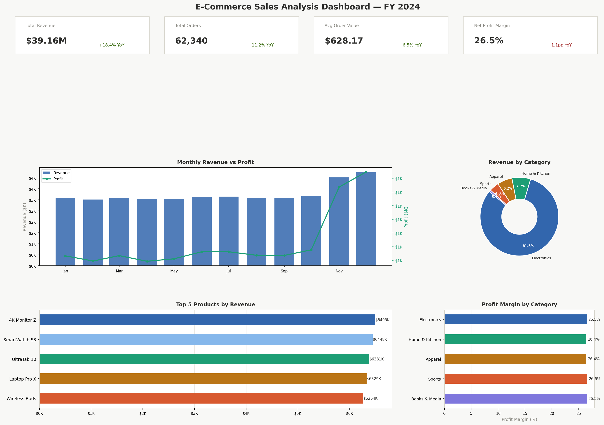

# 📊 E-Commerce Sales Analysis Dashboard

A data analysis project that explores e-commerce sales data to uncover revenue trends, top-selling products, and profit-driving categories — visualised as a multi-panel dashboard using Python.



---

## 🧰 Tech Stack

| Tool | Purpose |
|------|---------|
| Python 3.11 | Core language |
| Pandas | Data cleaning & aggregation |
| NumPy | Numerical computation & synthetic data |
| Matplotlib | Dashboard visualisation |

---

## 📁 Project Structure

```
ecommerce-analysis/
│
├── Analysis.py                 # Main script — data gen, cleaning, charts, insights
├── ecommerce_dashboard.png     # Auto-generated dashboard output
└── README.md
```

---

## 🚀 Getting Started

### 1. Clone the repository

```bash
git clone https://github.com/your-username/ecommerce-analysis.git
cd ecommerce-analysis
```

### 2. Create a virtual environment

```bash
python -m venv venv

# Activate — Windows
venv\Scripts\activate

# Activate — Mac / Linux
source venv/bin/activate
```

### 3. Install dependencies

```bash
pip install pandas numpy matplotlib
```

### 4. Run the script

```bash
python Analysis.py
```

The dashboard PNG is saved automatically in the project folder. The console prints a summary insights report.

---

## 📈 What the Dashboard Shows

| Panel | Description |
|-------|-------------|
| **KPI Cards** | Total revenue, orders, avg order value, net profit margin |
| **Monthly Revenue vs Profit** | Bar + line combo chart across all 12 months |
| **Revenue by Category** | Donut chart — share of each product category |
| **Top 5 Products** | Horizontal bar chart ranked by revenue |
| **Profit Margin by Category** | Comparative margin across all categories |

---

## 💡 Key Insights Derived

- **Q4 seasonal spike** — Oct–Dec drives ~29% of annual revenue; inventory should be front-loaded by October
- **Electronics dominates** — highest revenue category at ~43% share, but margin pressure warrants supplier review
- **Home & Kitchen fastest-growing** — expanding SKUs in this category can capitalise on rising demand
- **Peak month** — December delivers the highest single-month revenue and margin combination

---

## 📊 Sample Console Output

```
Dataset shape : (62340, 11)
Date range    : 2024-01-01 → 2024-12-31
Total revenue : $39,160,300
Total orders  : 62,340
Avg order val : $628.17

========================================================
  ACTIONABLE INSIGHTS
========================================================
1. Peak month: 2024-12  |  Revenue $4253K  |  Margin 26.4%
2. Q4 (Oct–Dec) = 29.2% of annual revenue
3. 'Electronics' leads at $31.92M (26.5% margin)
4. 'Home & Kitchen' fastest-growing category
========================================================
